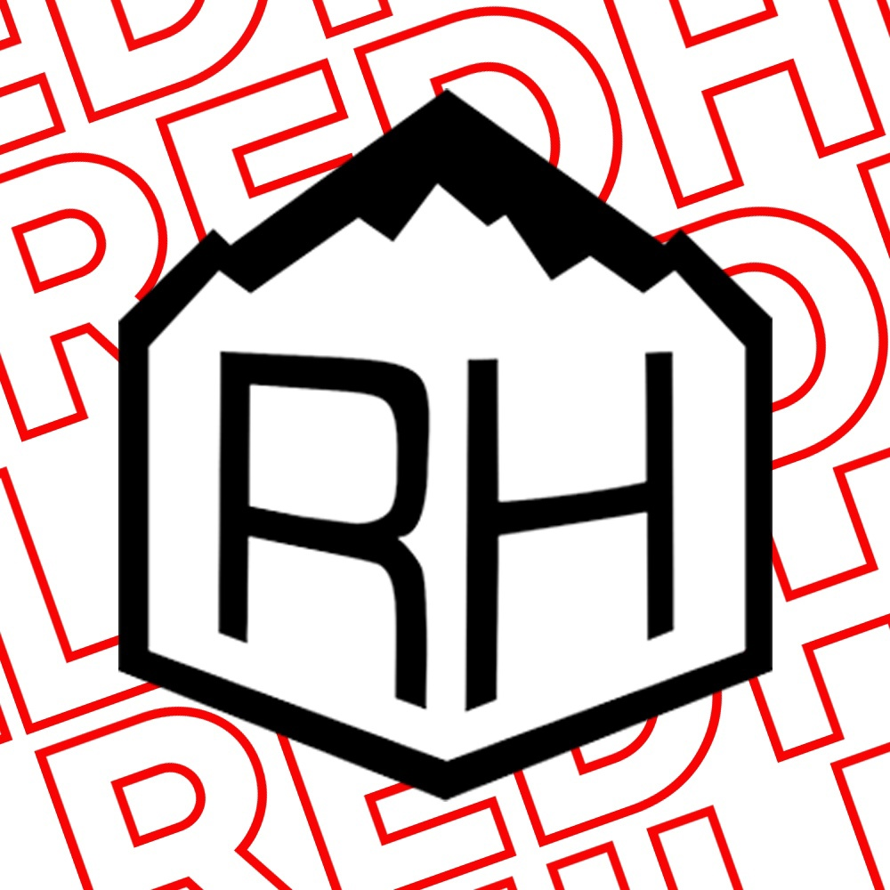

<div align="center">
  
  
  ### RedHill Бот
</div>


<div align="center" style='margin-top: 14px;'>
    
    
    
    <br>
    
    
</div>
<hr>

Бот ВКонтакте, созданный для сообщества школы №47 г. Кирова "[RedHill](https://vk.com/club158690635)"
### Функционал:
- Предоставление расписания уроков *(поддерживается комьюнити)* и звонков на каждый день учебной недели
- Навигатор в экосистеме тематических сообществ школы
- Предоставление информации об администрации и контактах ОО
- Мотиватор: каждое утро рассылает информацию о новом дне, расписание уроков и мотивационную цитату *(временно отключено)*
<hr>

# Содержание
 - [Требования](#-требования)
 - [Установка](#-установка)
 - [Настройка](#-настройка)
 - [Использование](#-использование)
 - [Как можно помочь](#-как-можно-помочь)
 - [Команда продукта и контакты](#-команда-продукта-и-контакты)

## [•](#содержание) Требования
- Python 3.10+
- *Раздел в разработке*
## [•](#содержание) Установка
Чтобы модифицировать код для создания собственной версии бота или долгосрочной поддержки нашего бота:
```bash
# Клонируйте репозиторий
git clone https://github.com/ViktorKoryakov/RedHill-Bot.git

# Перейдите в клонированный репозиторий продукта
cd RedHill-Bot

# Установите зависимости
pip install -r requirements.txt
```
## [•](#содержание) Настройка
Если вы собираетесь использовать модификацию кода для собственных нужд, необходимо изменить некоторые технические данные:
<table>
    <tr>
        <th>Файл</th>
        <th>Сущность</th>
        <th>Тип данных</th>
        <th>Необходимые данные</th>
    </tr>
    <tr>
        <td rowspan=8 align='center'>.env</td>
    </tr>
    <tr>
        <td>TOKEN</td>
        <td rowspan=7 align='center'>str</td>
        <td>Ключ доступа сообщества ВКонтакте с доступом к сообщениям</td>
    </tr>
    <tr>
        <td>DEVELOPER_ID</td>
        <td>ID аккаунта ВКонтакте главного разработчика. На этот ID выдаются все права в боте</td>
    </tr>
    <tr>
        <td>ADMINS_IDS</td>
        <td>Перечисление ID аккаунтов ВКонтакте, которым будет выдан статус администратора бота, через "<code>, </code>"</td>
    </tr>
    <tr>
        <td>PATH_TO_TEST</td>
        <td>Путь к директории, где бот используется для тестирования</td>
    </tr>
    <tr>
        <td>PATH_TO_RELEASE</td>
        <td>Путь к директории, где бот готов к релизу на сервер</td>
    </tr>
    <tr>
        <td>PATH_TO_SERVER</td>
        <td>Путь к директории на сервере, где бот функционирует</td>
    </tr>
    <tr>
        <td>SECRET_CONFIRM_MAILING</td>
        <td>Пароль для запуска рассылки (важно: все буквы должны быть строчными!)</td>
    </tr>
    <tr>
        <td>main.py</td>
        <td>MAX_ACTIVITY_MEMORY</td>
        <td>int</td>
        <td>Сколько последних сообщений каждого пользователя должен запоминать антиспамер</td>
    </tr>
</table>

## [•](#содержание) Использование
*Раздел в разработке*
## [•](#содержание) Как можно помочь
- Создавайте сообщения об ошибках в боте, предлагайте новые идеи и задавайте вопросы с помощью [Issues](https://github.com/ViktorKoryakov/RedHill-Bot/issues)
- Работайте над кодом и предлагайте свои изменения с помощью создания [форка](https://github.com/ViktorKoryakov/RedHill-Bot/fork) и [Pull Request](https://github.com/ViktorKoryakov/RedHill-Bot/pulls)
- Если хотите войти в команду продукта и стать официальным разработчиком, напишите основателю в [ВКонтакте](#-команда-продукта-и-контакты)
- [ ] Необходимо перенести расписание для 1-11 классов из `.xls` [таблиц](https://github.com/ViktorKoryakov/RedHill-Bot/tree/main/%D0%A0%D0%B0%D1%81%D0%BF%D0%B8%D1%81%D0%B0%D0%BD%D0%B8%D1%8F%20%D1%83%D1%80%D0%BE%D0%BA%D0%BE%D0%B2) в [`.json`](https://github.com/ViktorKoryakov/RedHill-Bot/blob/main/lessons_schedule.json) бота
## [•](#содержание) Команда продукта и контакты
Начиная с 08.02.2025, бот находится в стадии **частичной заморозки**. Официальная разработка новых масштабных обновлений не производится, в релиз выпускаются только небольшие изменения от сообщества и разработчика
- Виктор Коряков - основатель и разработчик ([по всем вопросам](https://vk.com/id562280798))

### Благодарности
- Даниил А.
- Александр К. 
- Ольга Ж. 
- Яша Л. 
- Егор Д. 
- Татьяна Ф. 
- Татьяна Ш. 
- Дарья З.

<hr>
<span style='font-size: 13px; font-style: italic; color: gray'>
MIT License<br>
Copyright (c) 2025 Виктор Коряков<br>
See LICENSE file in the project root for more details
</span>