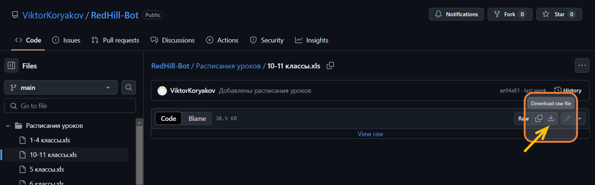
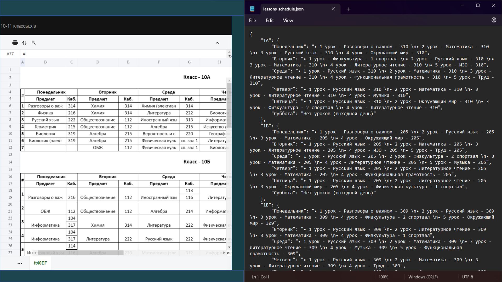
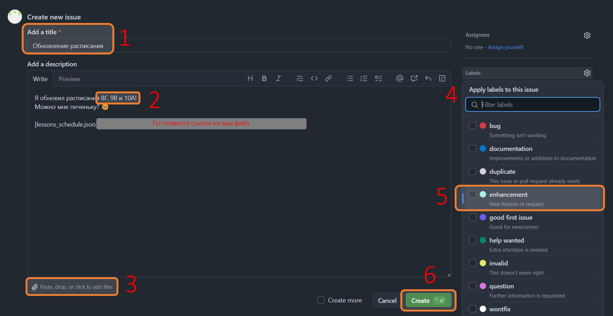
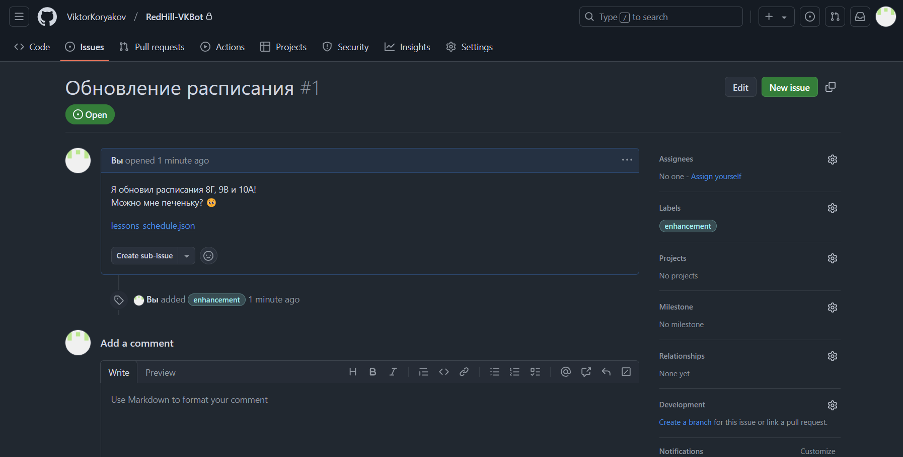

Привет! 👋🏻

Спасибо за интерес к переносу расписания. По пунктам расскажу что, как и зачем делать

> **Важно:** чтобы всё получилось, у вас должен быть аккаунт на GitHub *(где вы сейчас находитесь)*
# Начинаем и морально готовимся

1. Перейдём в папку "[`Расписания уроков`](https://github.com/ViktorKoryakov/RedHill-Bot/tree/1d2b71b18230f7da26c474fde872f58843076f4f/%D0%A0%D0%B0%D1%81%D0%BF%D0%B8%D1%81%D0%B0%D0%BD%D0%B8%D1%8F%20%D1%83%D1%80%D0%BE%D0%BA%D0%BE%D0%B2)" и найдём файл с расписанием той параллели, которая нам нужна. Например, 10-11 классов. Нажмём на него.
2. Внутри не будет сразу таблицы. Её нужно скачать, нажав на соответствующий значок "**Download raw file**".
   - Примечание: также можно нажать <kbd>Ctrl</kbd>+<kbd>Shift</kbd>+<kbd>S</kbd>.

3. Переходим в основную папку, находим [`lessons_schedule.json`](https://github.com/ViktorKoryakov/RedHill-Bot/blob/1d2b71b18230f7da26c474fde872f58843076f4f/lessons_schedule.json) и скачиваем таким же образом.
4. Открываем два скачанных файла.
   - `lessons_schedule.json` можно открыть блокнотом, если нет редактора кода.
   - Таблицу с расписанием уроков можно открыть любым сайтом для просмотра таблиц из интернета, если нет Excel.
5. Распологаем окна удобно для глаз (для меня удобно, чтобы в одной части экрана была таблица с расписанием, а в другой - файл, который редактирую.

6. Находим в обеих окнах расписание того класса, который собираемся изменить. Например, 10А.
7. Как только всё готово, включаем приятную музыку на фон *(проверено: помогает)* и начинаем сверять расписание.

# Работаем и наслаждаемся процессом
1. Шаблон, который вам пригодится - `\n•` - для визуального переноса на следующую строчку и начальный символ каждого урока
2. Если класс учится во вторую смену/не с первого урока:
   - Первая цифра - порядковый номер урока конкретно **у этого класса**
   - Вторая цифра (в скобках) - порядковый номер урока **с начала дня**
   - Например:  
    `1 (7)` - 1 урок этого класса - 7 урок с начала дня;  
    `1 (2)` - класс начинает учиться со 2 урока  
    `7 (9)` - 7 урок этого класса приходится на 9 урок с начала дня
   - Понять какой урок 2-ой смены вы видите можно по цифрам после `:` в столбце `#`.  
    `2:06` - 6 урок с начала дня  
    `7:11` - 11 урок с начала дня
3. Если класс поделён на 2 группы, у каждой из которых разные уроки/кабинеты - пишем по типу:
   - "• 3 (9) урок - Английский язык/Информатика - 113/104" 
   - "• 5 урок - Информатика - 104/317"
4. Названия некоторых предметов/кабинетов написаны не полностью/неясно. Как заносим их в файл с расписанием:
   - `(предмет) (эле...)` -> `(предмет) (электив)`
   - `Иностранный язы` -> `Английский язык`
   - `Разговоры о важ` -> `Разговоры о важном`
   - `Искусство устно` -> `Искусство устной и письменной речи`
   - `Физическая куль` -> `Физкультура`
   - `Вероятность и с` -> `Вероятность и статистика`
   - `Индивидуальный` -> `Индивидуальный проект`
   - `История России.` -> `История`
   - `Культура устной` -> `Культура устной и письменной речи`
   - `Секреты русского` -> `Секреты русского словообразования`
   - `Словообразовани` -> `Словообразование`
   - `Технология рабо` -> `Технология работы с КИМ`
   - `технологии мастерские` -> `мастерские`
   - `сп. зал 1/2` -> `1/2 спортзал`
   - *Список будет дополняться*
5. Если у класса нет какого-то урока посреди дня, так и пишем - `Окно (нет урока)`
6. Если у класса два урока одного предмета подряд, оба урока должны быть написаны раздельно:
   - Неправильно: `• 1-2 урок - Физкультура - 1 спортзал` и вариации
   - Правильно: `• 1 урок - Физкультура - 1 спортзал \n• 2 урок - Физкультура - 1 спортзал`

7. Не забываем сохранить свои труды после завершения работы!

# Выкладываем и гордимся собой
1. Переходим в раздел [Issues](https://github.com/ViktorKoryakov/RedHill-VKBot/issues)
2. Нажимаем на зелёную кнопку [New Issue](https://github.com/ViktorKoryakov/RedHill-VKBot/issues/new?template=Blank+issue)
   - Именно на этом этапе вам понадобится аккаунт GitHub  
   Если вы не хотите его создавать, скидывайте свою работу [мне](https://vk.com/im?sel=562280798) в ВКонтакте (в крайнем случае!)
3. Заполните поля нового Issue, обязательно укажите какие классы вы обновили и прикрепите файл с обновлённым расписанием. Желательно также выбрать label - enhancement
4. Нажмите на зелёную кнопку "Create".

### Готово! Если вы всё сделали правильно, вы должны попасть на страницу, выглядящую примерно как та, что ниже

Я постараюсь рассмотреть ваше изменение как можно скорее. Это может быть не быстро, учитывая повседневную загруженность и необходимость перепроверять каждую правку на действительность  
Но в любом случае если работа была выполнена хорошо, изменению – быть!

### По всем возникающим вопросам обращайтесь ко [мне](https://vk.com/im?sel=562280798) в ВКонтакте
